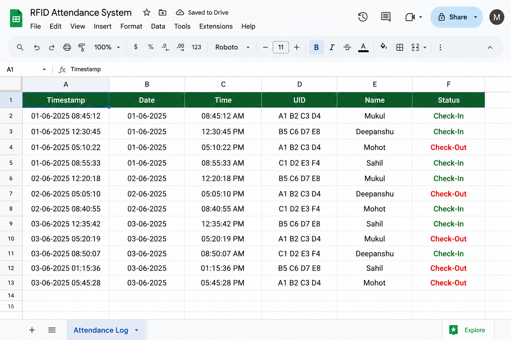

z<div align="center">

# 📡 RFID Attendance System

### Smart Attendance Management using ESP32, RFID & Google Sheets


<br>


</div>

---

# 🚀 About the Project

Managing attendance manually is time-consuming and prone to errors.

This project provides an **IoT-based Smart Attendance System** using the **ESP32** and **MFRC522 RFID Module**. Every time an RFID card is scanned, the system identifies the user, records the **Date**, **Time**, and **Attendance Status**, and instantly stores the information in **Google Sheets** through Wi-Fi.

---

# 📸 Preview

<p align="center">


<br><br>



</p>

---

# ⚡ Features

<table>
<tr>
<td>📶 Wi-Fi Enabled</td>
<td>🪪 RFID Authentication</td>
</tr>

<tr>
<td>📅 Real-Time Date</td>
<td>⏰ Real-Time Time</td>
</tr>

<tr>
<td>📊 Google Sheets Logging</td>
<td>✅ Check-In / Check-Out</td>
</tr>

<tr>
<td>⚡ Fast Response</td>
<td>🔒 Secure UID Verification</td>
</tr>

</table>

---

# 🛠 Hardware Used

| Hardware | Description |
|-----------|-------------|
| ESP32 | Main Controller |
| MFRC522 | RFID Reader |
| RFID Tags | User Identification |
| Breadboard | Prototype |
| Jumper Wires | Connections |
| Wi-Fi | Cloud Communication |

---

# 🔌 Wiring Diagram

| MFRC522 | ESP32 |
|---------|-------|
| SDA | GPIO 5 |
| SCK | GPIO 18 |
| MOSI | GPIO 23 |
| MISO | GPIO 19 |
| RST | GPIO 22 |
| 3.3V | 3.3V |
| GND | GND |

---

# 🔄 System Workflow

```text
RFID Card
     │
     ▼
RFID Reader
     │
     ▼
ESP32
     │
     ▼
User Verification
     │
     ▼
Current Date & Time
     │
     ▼
Google Sheets
```

---

# 📂 Repository Structure

```text
RFID-Attendance-System
│
├── README.md
├── code/
├── hardware/
├── images/
└── docs/
```

---

# 🌍 Applications

- 🎓 College Attendance
- 🏫 School Attendance
- 🏢 Office Attendance
- 📚 Library Access
- 🏠 Hostel Entry
- 🏭 Industrial Employee Tracking

---

# 🚀 Future Improvements

- 📱 Mobile Application
- ☁ Firebase Integration
- 👤 Face Recognition
- ✋ Fingerprint Authentication
- 📊 Analytics Dashboard
- 📧 Email Notifications

---

# 👨‍💻 Author

## Mukul Vaid

IoT Developer • Embedded Systems Enthusiast • ESP32 Projects

---

<div align="center">

## ⭐ If you like this project, please give it a Star ⭐

Made with ❤️ using ESP32

</div>
