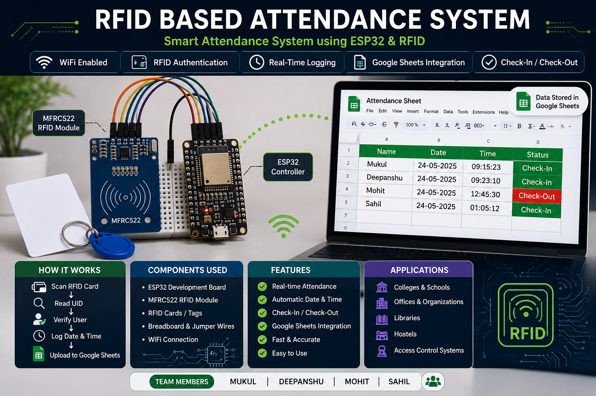

<div align="center">

# 📡 RFID Attendance System

### Smart Attendance Management using ESP32, RFID & Google Sheets


<br>


</div>

---

# 🚀 About the Project

The **RFID Attendance System** is an ESP32-based IoT solution that automates attendance using the **MFRC522 RFID Reader**. When a registered RFID card is scanned, the system authenticates the user, records the **Date**, **Time**, and **Attendance Status (Check-In / Check-Out)**, and uploads the data directly to **Google Sheets** over Wi-Fi.

This project is suitable for schools, colleges, offices, laboratories, and other organizations that require a reliable digital attendance system.

---

# 📸 Project Preview

## RFID Attendance System

<p align="center">

</p>

---

## Google Sheets Attendance Log

<p align="center">

</p>

---

# ✨ Features

- 📶 ESP32 Wi-Fi Connectivity
- 🪪 RFID Card Authentication
- ⏰ Real-Time Date & Time Logging
- 📊 Google Sheets Integration
- ✅ Automatic Check-In / Check-Out
- ⚡ Fast Attendance Processing
- 🔒 Unique RFID UID Verification
- 🌐 Cloud-Based Data Storage

---

# 🛠 Hardware Used

| Component | Description |
|-----------|-------------|
| ESP32 Development Board | Main Controller |
| MFRC522 RFID Reader | RFID Authentication |
| RFID Cards / Tags | User Identification |
| Breadboard | Circuit Assembly |
| Jumper Wires | Connections |
| USB Cable | Power Supply |
| Wi-Fi | Internet Connectivity |

---

# 🔌 Circuit Connections

| MFRC522 Pin | ESP32 Pin |
|-------------|-----------|
| SDA | GPIO 5 |
| SCK | GPIO 18 |
| MOSI | GPIO 23 |
| MISO | GPIO 19 |
| RST | GPIO 22 |
| 3.3V | 3.3V |
| GND | GND |

---

# 🔄 System Workflow

```text
RFID Card / Tag
        │
        ▼
MFRC522 RFID Reader
        │
        ▼
ESP32 Controller
        │
        ▼
User Authentication
        │
        ▼
Date & Time Logging
        │
        ▼
Google Sheets Database
```

---

# 📁 Repository Structure

```text
RFID-Attendance-System/
│
├── README.md
├── code/
├── docs/
├── hardware/
└── images/
    ├── banner.png
    ├── rfid-system.png
    └── google-sheet-output.png
```

---

# 🚀 Getting Started

### Software Required

- Arduino IDE
- ESP32 Board Package
- MFRC522 Library
- SPI Library
- WiFi Library
- Google Apps Script

### Steps

1. Install Arduino IDE.
2. Install the ESP32 Board Package.
3. Connect the MFRC522 module to the ESP32.
4. Configure your Wi-Fi credentials.
5. Upload the program to the ESP32.
6. Scan an RFID card.
7. View attendance records in Google Sheets.

---

# 🌍 Applications

- 🎓 College Attendance System
- 🏫 School Attendance System
- 🏢 Office Attendance Management
- 📚 Library Access Control
- 🏠 Hostel Entry Monitoring
- 🏭 Employee Attendance Tracking

---

# 🚀 Future Improvements

- 📱 Mobile Application
- ☁ Firebase Integration
- 👤 Face Recognition
- ✋ Fingerprint Authentication
- 📊 Web Dashboard
- 📧 Email Notifications
- 📈 Attendance Analytics

---

# 👨‍💻 Author

### Mukul Vaid

**IoT Developer | ESP32 Enthusiast | Embedded Systems**

---

# 📜 License

This project is intended for educational and academic purposes.

---

<div align="center">

## ⭐ If you found this project useful, please give it a Star!

**Made with ❤️ using ESP32**

</div>
